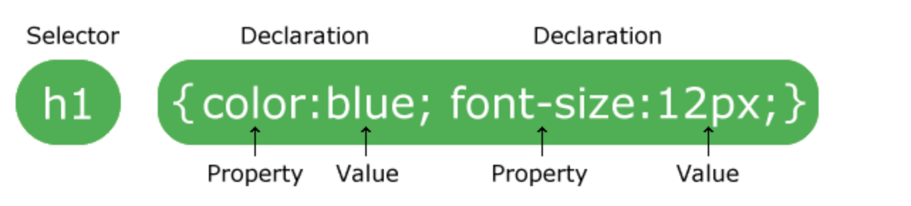

# CSS

This is now the fun part. You going to style your page to look beautiful. In short, CSS adds colors to HTML Elements, indenting content, setting borders, etc.

### How to Do this

Right, this entails embedding css in an HTML file\(remember from HTML Basics\). Examples:

#### CSS Structure



CSS Example

```text
p {
  color: blue;
  text-align: center;
  padding-right: 20px;
}
```

Adding css on the `head` tags in HTML

```text
<html>
<head>
    <title>first app</title>
    <style>
        p {
            color: red;
            font-size: 30px;
        }
    </style>
</head>
    <body bgcolor="lightblue">
        <p>Hello World</p>
    </body>
</html> 
```

Inline CSS i.e. inside html single line

```text
<p style="color: red;">Hello World</p>
```

External file CSS. That's, create an a css file `style.css` and add the css contents in it. Inside the HTML file, add the following line inside the head tags, so that css contents can be used.

```text
<html>
<head>
    <title>first app</title>
    <Link rel="stylesheet" type="text/css" href="style.css" 
</head>
    <body>
        <p>Hello World</p>
    </body>
</html> 
```

### So which should I use

Actually it depends with you. It's always advisable to use external file css. However, you can use inline css for quick formatting and in the header tags for small apps. Keep in mind that:

* External stylesheet
* Internal stylesheet
* Inline stylesheet

### Now What?

Now that you have understood the basics of how to add the css in the HTML, lets get to know some important CSS stuff. **esto es divertido\(es\)** - This is fun.

#### At the End, You should know this 

* [ ] Colors
* [ ] Background - colors and images
* [ ] Borders
* [ ] Margins
* [ ] Padding
* [ ] Heights and widths
* [ ] Links
* [ ] Display
* [ ] Tables
* [ ] Position
* [ ] Overflow
* [ ] Forms

