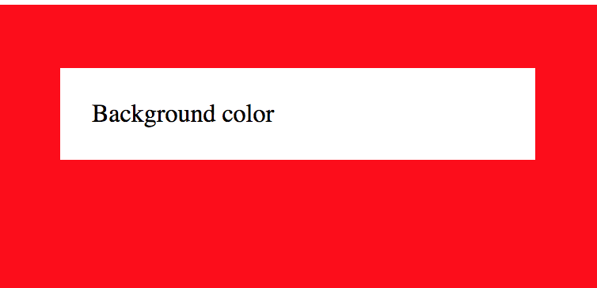
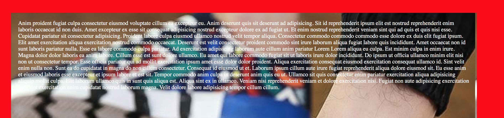

# Backgrounds

There are different things that can be added to the background including videos. It's just like having an element on top of other elements.

### Background Colors

Uses the same criteria \(i.e. color names, codes\) as css colors, only that **property** name changes.

```text
<!-- syntax -->
background-color: white;
```

```text
<!-- complete code -->
<!DOCTYPE html>
<html lang="en">
<head>
    <meta charset="UTF-8">
    <meta name="viewport" content="width=device-width, initial-scale=1.0">
    <meta http-equiv="X-UA-Compatible" content="ie=edge">
    <title>Colrs and imagest</title>
    <style>
        #wrapper {
            padding: 40px;
            background-color: red;
            height: 200px;
            width: 300px
        }
        #color {
            padding: 20px;
            background-color: white;
        }
    </style>
</head>
<body>
    <div id="wrapper">
        <div id="color">Background color</div>
    </div>
</body>
</html>
```

#### End Result



### Background Images

This was always fun for me, when i started out. For an example, check this out [link](https://nicanor008.github.io/Nicanor-HomePage/). 

```text
<!-- Syntax -->
background-image: url("path/imageName.extension");
```

```text
<!-- complete code -->
<!DOCTYPE html>
<html lang="en">
<head>
    <meta charset="UTF-8">
    <meta name="viewport" content="width=device-width, initial-scale=1.0">
    <meta http-equiv="X-UA-Compatible" content="ie=edge">
    <title>Colrs and imagest</title>
    <style>
        #wrapper {
            padding: 40px;
            background-color: red;
        }
        #color {
            padding: 20px;
            height: 600px;
            width: 80%;
            background-color: white;
            background-image: url('mens_wear.png');
            color:white;
        }
    </style>
</head>
<body>
    <div id="wrapper">
        <div id="color">Anim proident fugiat culpa consectetur eiusmod voluptate cillum ea excepteur eu. Anim deserunt quis sit deserunt ad adipisicing. Sit id reprehenderit ipsum elit est nostrud reprehenderit enim laboris occaecat id non duis. Amet excepteur ex esse sit consequat adipisicing nostrud excepteur dolore ex ad fugiat ut. Et enim nostrud reprehenderit veniam sint qui ad quis et quis nisi esse.
Cupidatat pariatur sit consectetur adipisicing. Proident labore culpa eiusmod ullamco nostrud velit tempor aliqua. Consectetur commodo commodo commodo esse dolore ex duis elit fugiat ipsum. Elit amet exercitation aliqua exercitation nostrud commodo occaecat. Deserunt est velit consectetur proident commodo sint irure laborum aliqua fugiat labore quis incididunt. Amet occaecat non id sunt laboris pariatur nulla.
Esse ea labore commodo culpa pariatur. Ad exercitation adipisicing laborum aute cillum anim pariatur Lorem Lorem aliqua eu culpa. Est minim culpa in enim irure. Magna dolor dolor laboris ea anim labore. Cillum esse est sunt dolore ullamco. Eu amet qui labore commodo fugiat sit ut laboris irure dolor incididunt.
Do ipsum ut officia ullamco minim elit nisi non ut consectetur tempor. Esse officia pariatur qui ad mollit exercitation ipsum amet esse dolor dolor proident. Aliqua exercitation consequat eiusmod exercitation consequat ullamco id. Sint velit enim nulla non. Sunt ea do cupidatat in magna do non cillum consectetur. Consequat id eiusmod ut et.
Laborum ipsum cillum aute irure fugiat reprehenderit aliqua dolore eiusmod sit. Eu esse anim et eiusmod laboris esse excepteur et ipsum labore et est sit. Tempor commodo anim culpa in deserunt anim quis eu ut. Ullamco sit quis consectetur enim pariatur exercitation aliqua adipisicing aliquip mollit culpa. Elit laborum ullamco quis in sunt quis aliqua est. Aliqua sint ex in ullamco.
Veniam nisi reprehenderit veniam et dolore exercitation nisi. Fugiat non aute adipisicing exercitation quis sint exercitation enim cupidatat nostrud laborum magna. Velit dolore labore adipisicing tempor cillum cillum.</div>
    </div>
</body>
</html>
```



