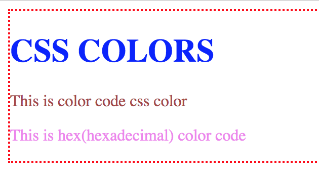

# CSS Colors

Colors are added when we need to change color of text or border. Lets get into this. I am going to use **inline css.**

The block of code below can also be found on [github](https://github.com/Nicanor008/Mentorship-101/blob/master/css/colors.html)



```text
<html>
<head>
    <title>CSS Colors</title>
</head>
<body>
    <div style="border:2px dotted red">
        <h1 style="color:blue">CSS COLORS</h1>
        <p style="color:rgb(165, 71, 71)">This is color code css color</h1>
        <p style="color:#ee82ee">This is hex(hexadecimal) color code</p>
    </div>
</body>
</html>
```



On running this on browser, you should see this,



