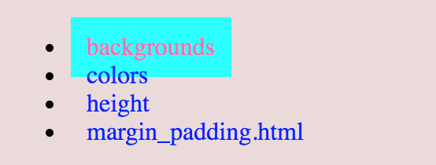

# CSS Links

Links help to navigate different pages.

```text
<!-- Syntax -->
a { color: hotpink; }
```



```text
<!-- complete code -->
<!DOCTYPE html>
<html lang="en">
<head>
    <meta charset="UTF-8">
    <meta name="viewport" content="width=device-width, initial-scale=1.0">
    <meta http-equiv="X-UA-Compatible" content="ie=edge">
    <title>Colrs and imagest</title>
    <style>
        #wrapper {
            padding: 40px;
            background-color: rgb(236, 218, 218);
        }
        #color {
            padding: 20px;
            height: 600px;
            width: 80%;
            background-color: white;
            background-image: url('mens_wear.png');
            color:white;
        }
        a {
            color: blue;
            text-decoration: none;
            padding: 10px;
        }
        a:active {
            color: red;
            }
        a:hover {
            color: hotpink;
            background-color: aqua;
        }
    </style>
</head>
<body>
    <div id="wrapper">
        <br/>
        <div id="nav-link">
            <ul>
                <li class="active"><a href="backgrounds.html">backgrounds</a></li>
                <li><a href="colors.html">colors</a></li>
                <li><a href="height.html">height</a></li>
                <li><a href="margin_padding.html">margin_padding.html</a></li>
            </ul>
        </div>
</body>
</html>
```





