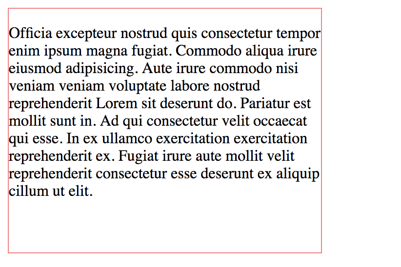

# Heights and Width

Appropriate sizing your elements within page will help in better styling.

Measurements can be in **pixels, inches, percent, centimeters.**

**Note:** There is usage of id **selector.** There are different selectors used like **class, type** selectors. This help to identify HTML elements to be styled.

Code available on [github](https://github.com/Nicanor008/Mentorship-101/blob/master/css/height.html)



```markup
<!DOCTYPE html>
<html lang="en">
<head>
    <meta charset="UTF-8">
    <meta name="viewport" content="width=device-width, initial-scale=1.0">
    <meta http-equiv="X-UA-Compatible" content="ie=edge">
    <title>CSS Height & Widths</title>
    <Style>
        #wrapper {
            height: 250px;
            width: 320px;
            border: 1px solid lightcoral;
        }
    </Style>
</head>
<body>
    <div id="wrapper">
        <p>
            Officia excepteur nostrud quis consectetur tempor enim ipsum magna fugiat. Commodo aliqua irure eiusmod adipisicing. Aute irure commodo nisi veniam veniam voluptate labore nostrud reprehenderit Lorem sit deserunt do. Pariatur est mollit sunt in. Ad qui consectetur velit occaecat qui esse. In ex ullamco exercitation exercitation reprehenderit ex. Fugiat irure aute mollit velit reprehenderit consectetur esse deserunt ex aliquip cillum ut elit.
        </p>
    </div>
</body>
</html>
```



End result:-



seguir aprendiendo\(spanish\) **- Keep learning**

