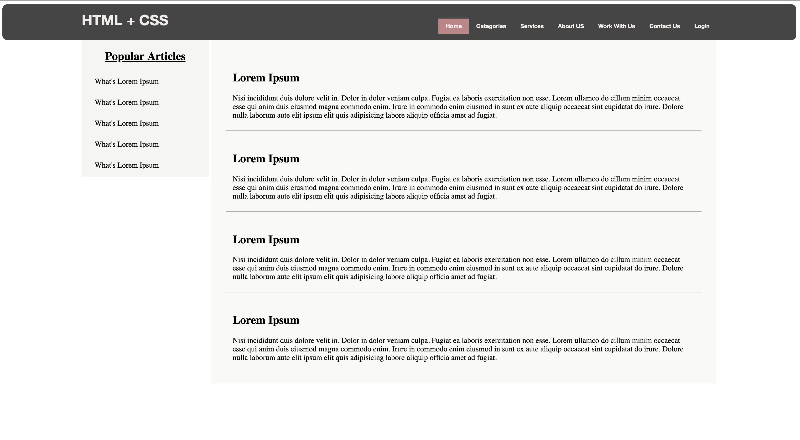

# Putting All together

### Note

Any project you make will have all these things in one place\(file/directory\). Lets put them together and see how these are combined.

I have included some other advanced stuff like fonts, position , colors that you haven't taken a look, `But you learning right` - I trust this is always a good way of learning `learning as you do in a mini-project` 

I have done everything in a single file `all_together.html` .It will be better if you obtain the codes from github here, because the file is too large.

Moreover, I'll show you the screenshot output once you also execute it on the browser.

Simple right? 

Somehow but you have to go through each and every line to understand. Start with HTML then reference to the specific element being style on CSS above it.

### Your Task

Create your own branch, `remember git` , then create your own file in HTML directory, save it as `yourname.html` . Create almost the same thing as above , but not exactly , should be somehow different. Once done, push to github.

`Estoy seguro de que estás aprendiendo (es) - Am sure you learning(en)` 

