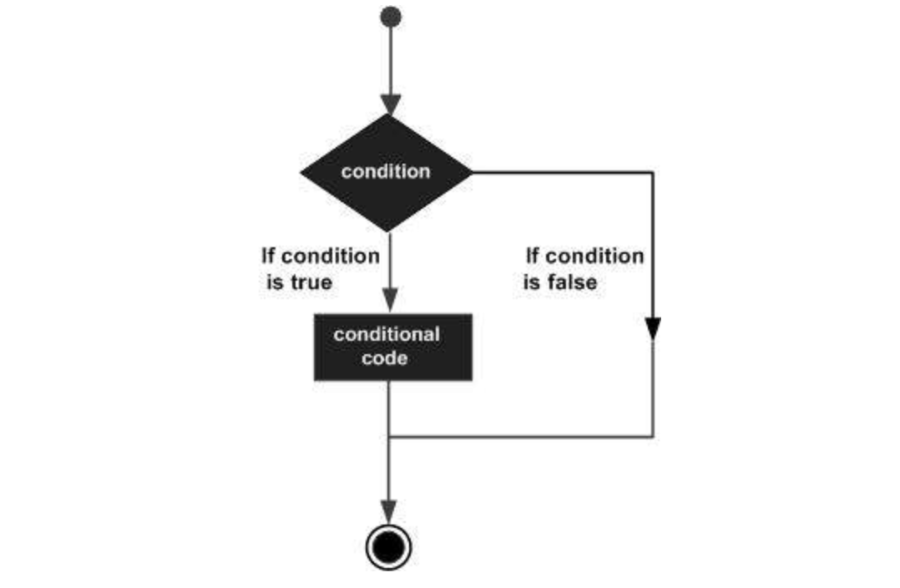
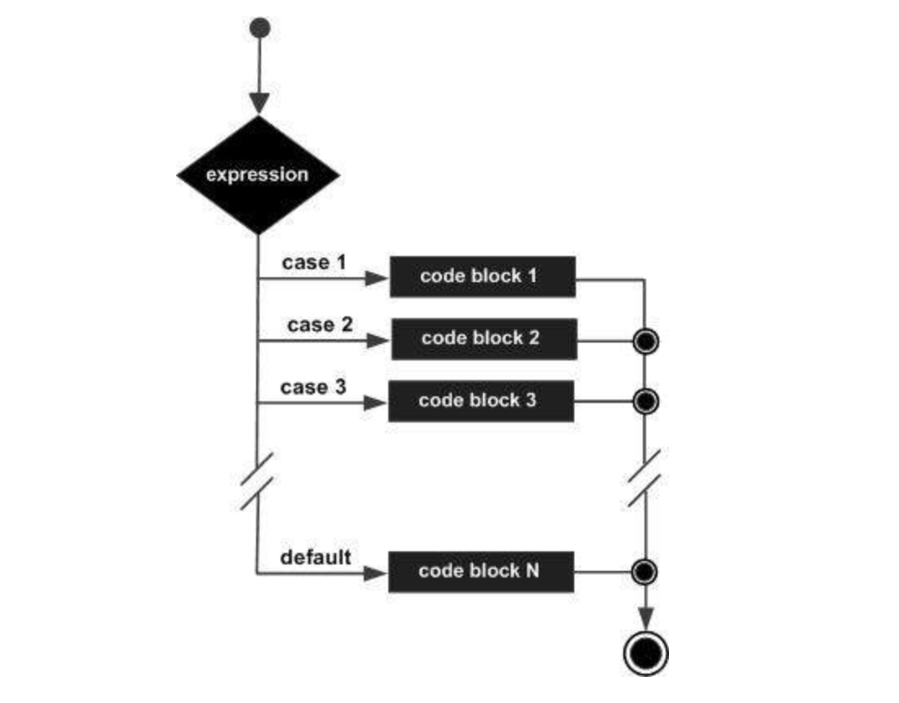

# General Programming

This section will discuss about the general things that applies to all programming languages. This includes ✍ 

* [x] What is programming
* [x] Variables
* [x] Constants
* [x] Data types
* [x] Keywords
* [x] Operators
* [x] Comments
* [x] Conditional Statements
* [x] Switch statements
* [x] Functions

We will discuss each and how it applies to programming.

### What is Programming

**Program -** Process of writing computer programs. **Programs -** written step by step instructions that guide users on how to do a specific task. You will be instructing the computer by giving specific instructions.

### Definition Of Terms

**Syntax** - Rules of a programming language. Every language has there own rules just like our natural languages. e.g. terminate every line with a semicolon at the end.

**Algorithms** - Set of rules/instructions in problem solving. Step by step instructions for solving a problem.

**Flowchart** - Diagramatic representation of an algorithm

### Variables

This is a computer storage location. Imagine asking a user for their names and store it in the computer's memory and you can call the **memory location**  anywhere in the program to use it.

**Variable Declaration** is just giving name to a variable while **Variable initialization** is giving value to a variable



```text
// Variable Example
String Movie;  // variable declaration

Movie = "Avengers-End Game";   //variable initialisation

//variable declaration and initialisation
String MyPlatform = "Coding 101 Platform";
```



**Rules of writing variables**

Specific languages follow specific rules. This includes:

* A variable cannot start with a number
* A variable can start with a dollar sign \(`$`\), underscore\(`_`\) , capital or small letter.
* variables are case-sensitive
* Variables cannot have keywords

### Constants

These are same with variables only that they don't change once initialised.  Variables can be re-initialised but constants can't change.

```text
// constants syntax
const PIE = 3.142;

// using the above constant
int area = 0.5 * PIE * 7 * 7;
```

### Keywords

These are the reserved words used by a specific language to do something. Like above `const` is a reserved keyword for constants.


 **Note** each language has specific keywords.


### Data Types

There are a lot of data that we use to come up with programs. The most common include:

* Integers - Include numbers e.g. `int num1 = 100` 
* Characters - \( `char` \) single lettered  `char 1st = 'r'`  
* Strings - \(`string` \) Combination of characters data types `string MyName = "Nicanor"` 
* Boolean - `bool` values required for true or false occasions.
* Float - used for numbers but with decimal values `float num2 = 5.434` 
* Double - used for numbers with large decimal values `double num = 5.4324343434343` 
* Array - Collection of the same data types `int numValues = [3, 2, 4, 5, 2, 43, 23]` 
* Object - Data type which stores data and information on how to process that data e.g. `const Names = { Name : "Nicanor" }`   

### TypeOf Operator

Returns the type of argument. If you want to check the type of data type you using 

```text
typeof "foo";
// result will be shown on the console after execution
```

### Operators

This includes combination of more than one data type, preferably integers, float and double. These include 

* **Arithmetic** Operators - `+, -, *, modulas(%), /` . 
* **Assignment** Operator - `=`  e.g.  `int x = 100;`  
* **Logical** Operators - `&&(AND) , OR(||), not(!)` 
* **Relational** Operators- Used when making comparisons `>, <, >=, <=, equal to(==), not equal to(!=)` e.g. \(`10 >= 20) && ('c' == 'd')` 

More advanced operators include **conditional Operator** that uses **ternary operator \(?\)** e.g.

```text
expression1 ? expression2 : expression3 ;
```

### Comments

Used by programmers to explain their code. Cannot be read by the program during execution. Every language has its own syntax of writing comments e.g.

```text
// this is a javascript/java comment
<!-- HTML Comment -->
# PHP comment
```

### Conditionals Statements

Used to perform different actions based on different conditions. Based on making decisions. The diagram below shows **if....else statement**



The following are conditions we going to discuss about 

* If statement
* If ... else statement
* if ... else if ... statement

**If Statement**

**C**ontrol statements that allows to make decisions and execute statements conditionally. Syntax is as follows:

```text
if (expression) {
   Statement(s) to be executed if expression is true
}

// e.g
int x = 10;
if (x > 5) {
   print('x is greater than 5');
}
```

**If ... else Statements**

Allows execution of statements in a more controlled way. Syntax and an example

```text
if (expression) {
   Statement(s) to be executed if expression is true
} else {
   Statement(s) to be executed if expression is false
}

// an example
int x = 10;
if (x > 5) {
   print('x is greater than 5');
} else {
   print('x is less than 5');
}
```

**If ... else if ... Statements**

Advanced form of If ... else statements that allows making correct decisions based on several conditions. Syntax is as below

```text
if (expression 1) {
   Statement(s) to be executed if expression 1 is true
} else if (expression 2) {
   Statement(s) to be executed if expression 2 is true
} else if (expression 3) {
   Statement(s) to be executed if expression 3 is true
} else {
   Statement(s) to be executed if no expression is true
}
```

### Switch Statements

This is an alternative of **If ... else statements** by minimising the repeated statements. Flowchart is as shown below



**Syntax**

```text
switch (expression) {
   case condition 1: statement(s)
   break;
   
   case condition 2: statement(s)
   break;
   ...
   
   case condition n: statement(s)
   break;
   
   default: statement(s)
}
// Note - Default is there so that if all the other case won't execute
          Break is used to exit out of that case and stop execution
```

**An example of Switch statements**

```text
char grade = 'A';
switch (grade) {
   case 'A': print("Good job<br />");
            break;

   case 'B': print("Pretty good<br />");
            break;

   case 'C': print("Passed<br />");
            break;

   case 'D': print("Not so good<br />");
            break;

   case 'F': print("Failed<br />");
            break;

   default:  print("Unknown grade<br />")
}

// Result
Good job
```

### Functions

This is a group of code that does a specific thing. Also a group of re-usable code. `Syntax` 

```text
function functionname(parameters) {
    // statements
}
```

**Function Declaration** is just like the above function syntax. Just writing group of codes to do specific task

**Function Calling**  is using the function in other places. You just call the function name in several places that needs application. `functionname(arguments)` 

**Parameters** are like variables that are passed into the function

**Arguments** are real values that will replaces the parameters and be used in the function.

```text
<html>
   <head>  
      <script type = "text/javascript">
         function concatenate(first, last) {
            var full;
            full = first + last;
            return full;
         }
         function secondFunction() {
            var result;
            result = concatenate('Zara', 'Ali');
            document.write (result );
         }
      </script>      
   </head>
   
   <body>
      <p>Click the following button to call the function</p>      
      <form>
         <input type = "button" onclick = "secondFunction()" value = "Call Function">
      </form>      
      <p>Use different parameters inside the function and then try...</p>  
  </body>
</html>
```


