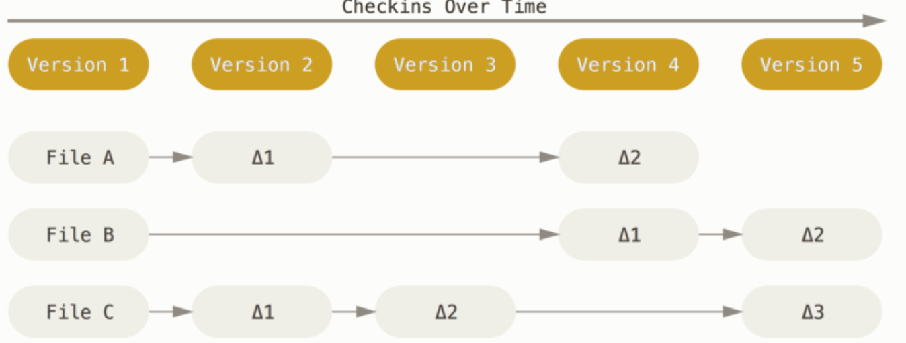

# GIT - Version Control

**Version control** is a system that records changes to a file or set of files over time so that you can recall specific versions later. Versioning of files/projects.

There are different [types of version control systems](https://git-scm.com/book/en/v2/Getting-Started-About-Version-Control). **Distributed Version control system** remote repository which is stored in a server and a local repository which is stored in the computer of each developer. This means that the code is not just stored in a central server, but the full copy of the code is present in all the developers’ computers. Git is a Distributed Version Control System since the code is present in every developer’s computer.



### Do I Really need Version Control?

Yes, you do. Real time projects worked on in parallel teams will always require you revert back and forth to an older version of your code. Also it independence through branching, hence you can comfortably work on your task in a team without much conflicts. `Don't worry you will understand with time`

### What is Git?

Git is the most commonly used version control. Git is an example of DVCS - `Distributed Version Control System` . Experienced software developers understand how to use git well, it's a well represented field.

Git features performance, security and flexibility.

### Installing Git

It's good to use git while you have an account at [Github](https://github.com) \(remember the "server"\). Go ahead and signup on [github.com](https://github.com)

#### Windows installation

Download [https://git-scm.com/download/win](https://git-scm.com/download/win) and install it. Read about [git for windows.](https://gitforwindows.org)

After installation, open git. Also you can create a folder for your projects, right click on it, click on `git bash` to execute git. Configure according to your credentials below.

#### Linux Installation\(Debian e.g. Ubuntu\)

On your terminal, run this 

```text
sudo apt install git-all
```

Configure according to your credentials below.

#### Mac-OS installation

The easiest way to install is to install xcode. Check if you have git, if you don't it will prompt you to install xcode.

```text
git --version
```

Configure according to your credentials below.

### Setting up git

You have to identify yourself to git. Remember your github credentials, time to use. On git bash, type the following with your credentials.

```text
git config --global user.name "Your username"
git config --global user.email Your-email-address
```

To check your credentials

```text
git config --list
```


Git uses linux commands.


### Common Git commands used

```text
cd - change directory e.g. (cd .. -moves back one directory)
ls - list all files and directories
pwd - print working directory (path)

git init - initialise a local project for version control
git clone - Taking a remote project to your local computer so you can
                start editing.
git status - to know status of your files after making changes
git add - add files on staging i.e. sending files from local server to 
                remote server but not yet in remote
git commit - appends a message to files to be sent to the remote server
                e.g. git commit -m "message";
git push - Sends the staged files to the remote server
git pull - brings remote(server) changes to local(your project)
```


There are a lot of git commands. For beginners, don't hurry to know all of them. but if you much curious, check out [here](https://github.com/joshnh/Git-Commands)



